# Mercado Express — CP5 Parte 1 (Spring Security MVC + PostgreSQL + Deploy)

Aplicação **Spring MVC** para uma empresa do tipo **mercado express** (meias, produtos de limpeza e hortifruti), continuação do tema do CP4 ([CP4P2-Java](https://github.com/Tidlle/CP4P2-Java)). Tem interface Web em **Thymeleaf**, persistência em **PostgreSQL** e autenticação/autorização com **Spring Security**: tela de login própria, tela de cadastro (Sign Up) e **dois perfis de usuário** (ADMIN e CLIENTE).

## Integrantes

- Eduardo Martins — RM562259
- João Victor Alcantara — RM562707

## Links

- **Deploy (produção):** https://cp5p1-java.onrender.com
- **Plataforma de deploy:** Render (Web Service com Docker + PostgreSQL gerenciado)
- **IDE utilizada:** IntelliJ IDEA

## Tecnologias e dependências

- Java 21
- Spring Boot 3.4.1 (Maven)
- Spring Web (MVC)
- Thymeleaf + `thymeleaf-extras-springsecurity6`
- Spring Security
- Spring Data JPA (Hibernate)
- Validation (Bean Validation)
- PostgreSQL Driver
- Lombok
- Spring Boot DevTools
- Bootstrap 5 (CDN) + CSS próprio
- **Bootstrap Icons 1.13.1**: biblioteca de ícones, instalada via WebJar (`org.webjars.npm:bootstrap-icons`)
- **Fonte Poppins**: instalada via WebJar (`org.webjars.npm:fontsource__poppins`)

> Os ícones e a fonte são dependências Maven servidas pela própria aplicação em `/webjars/**` (rota liberada no Spring Security). Eles não dependem de CDN externa.
- Testes: JUnit 5, Spring Security Test, H2 (somente nos testes)

### Spring Initializr

Configuração final no [start.spring.io](https://start.spring.io): Maven, Java 21, Jar, YAML, Spring Boot 3.4.x, com as dependências **Spring Web, Thymeleaf, Spring Security, Spring Data JPA, PostgreSQL Driver, Lombok, Validation e Spring Boot DevTools**.

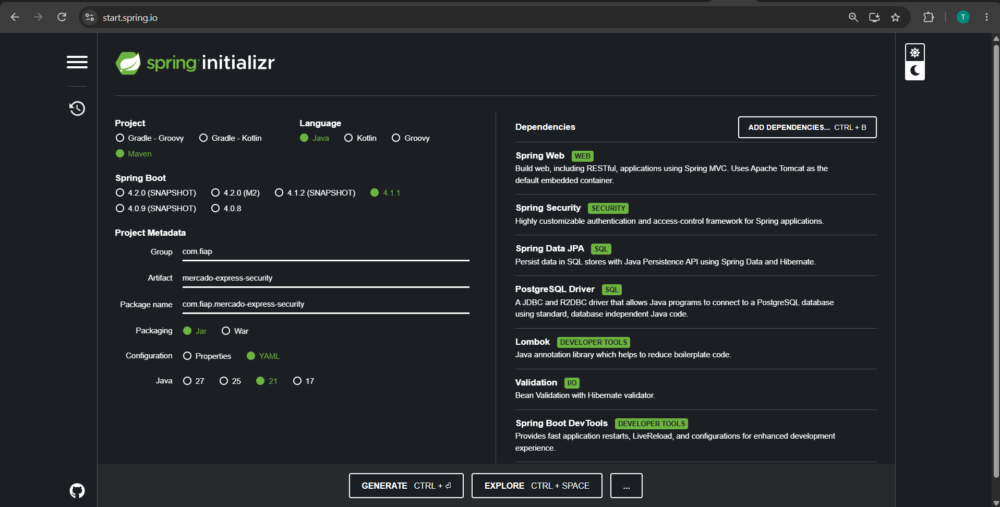

## Arquitetura

```
src/main/java/com/fiap/mercadoexpresssec
├── config
│   ├── SecurityConfig.java        # regras de acesso, login/logout, página 403
│   ├── LoginSuccessHandler.java   # redireciona ADMIN -> /admin, CLIENTE -> /mercado
│   ├── LoginFailureHandler.java   # e-mail não cadastrado -> /cadastro (Sign Up)
│   ├── PasswordConfig.java        # BCryptPasswordEncoder
│   └── DataInitializer.java       # cria o ADMIN inicial e produtos de exemplo
├── controller
│   ├── HomeController.java        # index, login, cadastro, acesso negado
│   ├── MercadoController.java     # CRUD de produtos
│   └── AdminController.java       # painel administrativo
├── dto/CadastroForm.java          # formulário do Sign Up
├── model                          # Mercado, Usuario, Role
├── repository                     # Spring Data JPA
└── service                        # regras de negócio + UserDetailsService
```

## Modelo de dados (PostgreSQL)

As tabelas são criadas automaticamente pelo Hibernate (`ddl-auto: update`). O PostgreSQL guarda os nomes em minúsculas.

**`TDS_Sec_MVC_TB_Mercado`**: produtos do mercado (entidade `Mercado`)

| Coluna  | Tipo     | Descrição |
|---------|----------|-----------|
| id      | bigint (identity) | Identificador |
| nome    | varchar(100) | Nome do produto |
| tipo    | varchar(60)  | Tipo (Fruta, Limpeza, Vestuário…) |
| setor   | varchar(60)  | Setor do mercado |
| tamanho | double   | Tamanho/medida |
| preco   | double   | Preço (R$) |
| estoque | integer  | Quantidade em estoque |

**`TDS_Users_Mercado`**: usuários do sistema (entidade `Usuario`)

| Coluna        | Tipo     | Descrição |
|---------------|----------|-----------|
| id            | bigint (identity) | Identificador |
| nome          | varchar(100) | Nome completo |
| email         | varchar(120), único | Login do usuário |
| senha         | varchar  | Hash **BCrypt**; a senha nunca é salva em texto puro |
| role          | varchar(20) | `ADMIN` ou `CLIENTE` |
| data_cadastro | timestamp | Data de criação da conta |

## Configuração (`application.yml`)

Toda configuração sensível vem de **variáveis de ambiente**. Os valores após `:` são só o padrão para rodar localmente:

```yaml
server:
  port: ${PORT:8080}

spring:
  datasource:
    url: ${DB_URL:jdbc:postgresql://${DB_HOST:localhost}:${DB_PORT:5432}/${DB_NAME:mercado_express}}
    username: ${DB_USERNAME:postgres}
    password: ${DB_PASSWORD:postgres}
  jpa:
    hibernate:
      ddl-auto: update

app:
  admin:
    nome: ${ADMIN_NOME:Administrador}
    email: ${ADMIN_EMAIL:admin@mercado.com}
    senha: ${ADMIN_SENHA:admin123}
```

| Variável | Para que serve |
|----------|----------------|
| `DB_URL` | URL JDBC completa (ex.: Neon/Supabase). Se não for definida, a URL é montada com `DB_HOST`, `DB_PORT` e `DB_NAME` |
| `DB_USERNAME` / `DB_PASSWORD` | Credenciais do PostgreSQL |
| `ADMIN_EMAIL` / `ADMIN_SENHA` | Usuário ADMIN criado automaticamente na primeira execução |
| `PORT` | Porta HTTP (o Render define sozinho) |

## Como executar localmente

1. Suba um PostgreSQL local com Docker:
   ```bash
   docker compose up -d
   ```
   (ou use um PostgreSQL já instalado com um banco `mercado_express`)
2. Rode a aplicação. No **IntelliJ IDEA**, execute a classe `MercadoExpressSecApplication`. Pelo terminal:
   ```bash
   mvn spring-boot:run
   ```
3. Acesse `http://localhost:8080`.

**Login ADMIN padrão (local):** `admin@mercado.com` / `admin123`. Em produção a senha vem da variável `ADMIN_SENHA`.

Para rodar os testes automatizados (usam H2 em memória, sem precisar de PostgreSQL):

```bash
mvn test
```

## Spring Security

### Perfis de acesso

| Perfil | Como é criado | O que pode fazer | Tela após o login |
|--------|---------------|------------------|-------------------|
| **ADMIN** | Automaticamente na inicialização (`DataInitializer`) | CRUD completo de produtos e painel administrativo com a lista de usuários | `/admin` |
| **CLIENTE** | Pela tela de cadastro (`/cadastro`) | Consultar a lista e os detalhes dos produtos (somente leitura) | `/mercado` |

### Rotas

| Rota | Método | Acesso |
|------|--------|--------|
| `/` (landing page `index.html`) | GET | Público |
| `/login` | GET/POST | Público |
| `/cadastro` | GET/POST | Público |
| `/mercado` (lista + busca) | GET | ADMIN, CLIENTE |
| `/mercado/{id}` (detalhe) | GET | ADMIN, CLIENTE |
| `/mercado/novo` | GET | ADMIN |
| `/mercado` (criar) | POST | ADMIN |
| `/mercado/{id}/editar` | GET | ADMIN |
| `/mercado/{id}` (atualizar) | POST | ADMIN |
| `/mercado/{id}/excluir` | POST | ADMIN |
| `/admin` | GET | ADMIN |
| `/logout` | POST | Autenticado |

A proteção é feita no backend pelo `SecurityFilterChain`. A interface também esconde os botões que o perfil não pode usar (`sec:authorize`). Se um CLIENTE tentar acessar uma rota de ADMIN pela URL, ele cai na página **403 – Acesso negado**.

```java
.authorizeHttpRequests(auth -> auth
        .requestMatchers("/", "/index", "/login", "/cadastro", "/acesso-negado", "/error").permitAll()
        .requestMatchers("/css/**", "/img/**", "/favicon.ico").permitAll()
        .requestMatchers("/admin/**").hasRole("ADMIN")
        .requestMatchers("/mercado/novo", "/mercado/*/editar", "/mercado/*/excluir").hasRole("ADMIN")
        .requestMatchers(HttpMethod.POST, "/mercado/**").hasRole("ADMIN")
        .requestMatchers(HttpMethod.GET, "/mercado", "/mercado/*").hasAnyRole("ADMIN", "CLIENTE")
        .anyRequest().authenticated()
)
.formLogin(form -> form
        .loginPage("/login")                 // tela de login própria (não a padrão do Spring)
        .usernameParameter("email")
        .passwordParameter("senha")
        .successHandler(loginSuccessHandler) // redireciona por perfil
        .failureHandler(loginFailureHandler) // usuário inexistente -> Sign Up
)
.exceptionHandling(ex -> ex.accessDeniedPage("/acesso-negado"));
```

### Implementação da tela de login

A tela padrão do Spring Security foi substituída por `templates/login.html`, com layout próprio em duas colunas, identidade visual do Mercado Express e mensagens de feedback (credenciais inválidas, logout e conta criada).

1. O formulário envia `email` e `senha` via `POST /login`, com token **CSRF** incluído automaticamente pelo Thymeleaf.
2. O `UsuarioDetailsService` busca o usuário em `TDS_Users_Mercado` pelo e-mail e entrega ao Spring Security o hash BCrypt e o perfil (`ROLE_ADMIN` ou `ROLE_CLIENTE`).
3. **Sucesso:** o `LoginSuccessHandler` manda o ADMIN para `/admin` e o CLIENTE para `/mercado`.
4. **Falha:** o `LoginFailureHandler` verifica se o e-mail existe no banco:
   - **Não existe:** redireciona para a tela de **Sign Up** (`/cadastro?naoEncontrado`), com o e-mail já preenchido. Ele é guardado na sessão, não na URL.
   - **Existe** (senha errada): volta para `/login?error`.

> Por padrão, o Spring Security esconde a `UsernameNotFoundException` e a transforma em `BadCredentialsException`. Por isso a verificação de "usuário não cadastrado" é feita no `LoginFailureHandler`, consultando o banco diretamente.

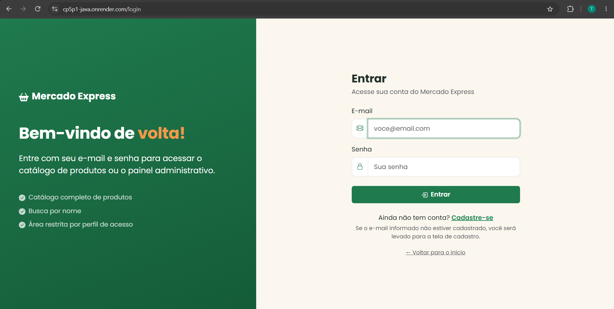

**Exemplo 1: e-mail não cadastrado.** O usuário digita `novo@email.com` no login e é levado ao Sign Up com o aviso "Não encontramos uma conta com esse e-mail" e o campo e-mail preenchido.


**Exemplo 2: senha errada.** A tela de login exibe "E-mail ou senha inválidos".

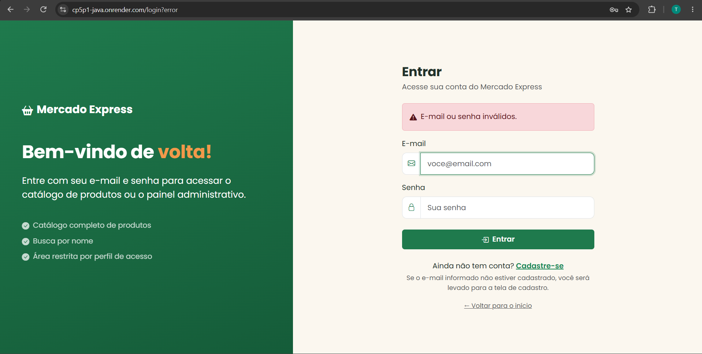

### Tela de cadastro (Sign Up)

`templates/cadastro.html` valida nome, e-mail, tamanho mínimo da senha (6), confirmação de senha e e-mail duplicado. A conta é salva em `TDS_Users_Mercado` com perfil **CLIENTE** e senha em **BCrypt**. Depois o usuário é levado ao login com a mensagem "Conta criada com sucesso".

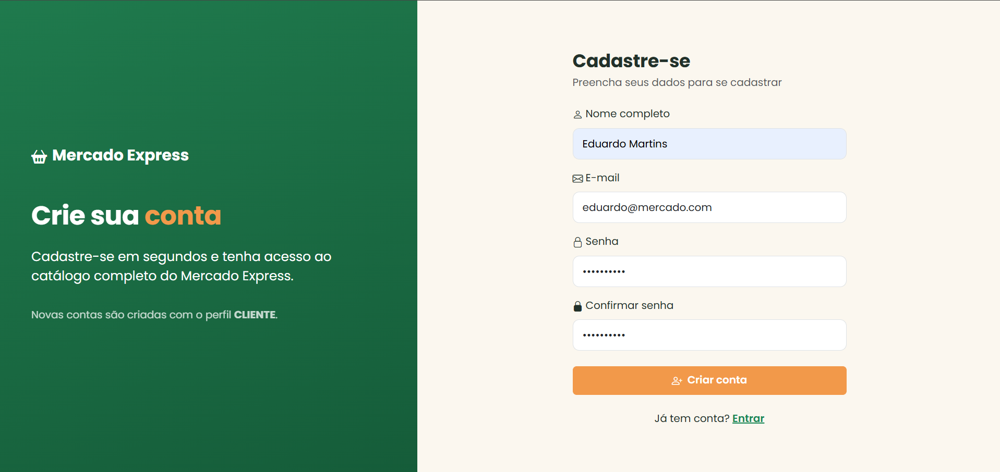

## Telas da aplicação

### Landing page (`index.html`)

Página inicial pública, com botões "Entrar" e "Criar conta".

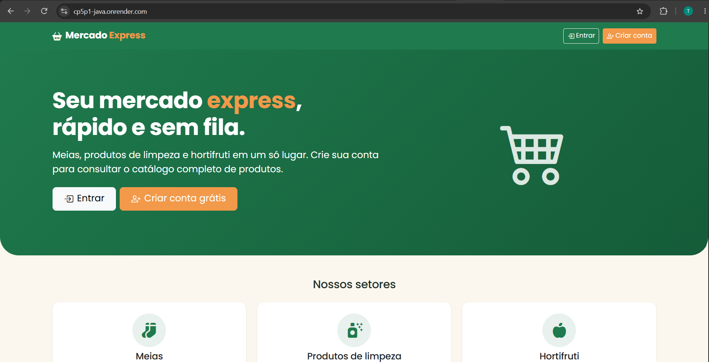

### Painel administrativo (ADMIN)

Mostra os totais de produtos, clientes e administradores, além da lista de usuários cadastrados.

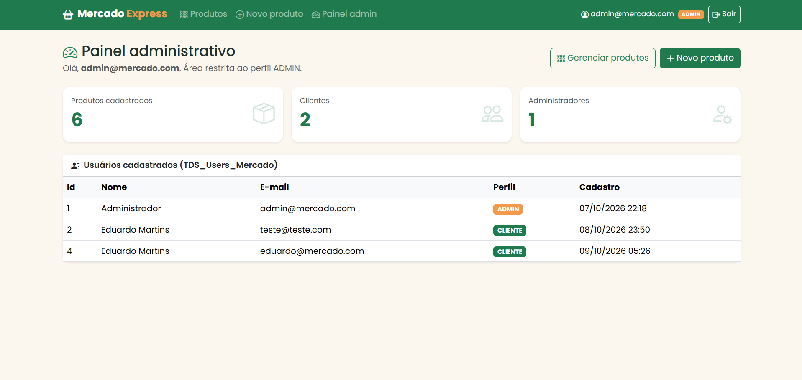

### Read: lista de produtos e busca

Consulta a tabela `TDS_Sec_MVC_TB_Mercado` e mostra o resultado no navegador. Tem busca por nome. O ADMIN vê os botões **Editar**, **Excluir** e **+ Novo produto**. O CLIENTE vê apenas **Ver**.

| ADMIN | CLIENTE |
|-------|---------|
| 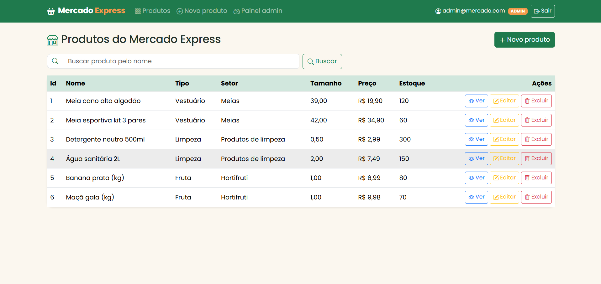 | 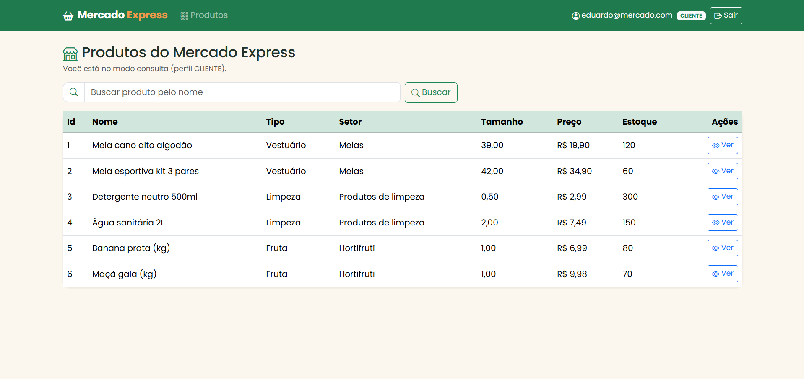 |

### Read: detalhe do produto

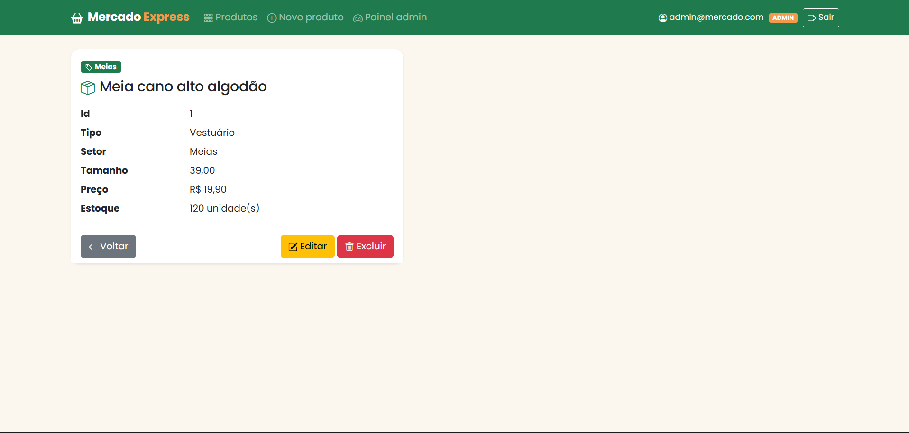

### Create: novo produto (ADMIN)

Formulário com validação (campos obrigatórios, preço e tamanho maiores que zero, estoque não negativo).

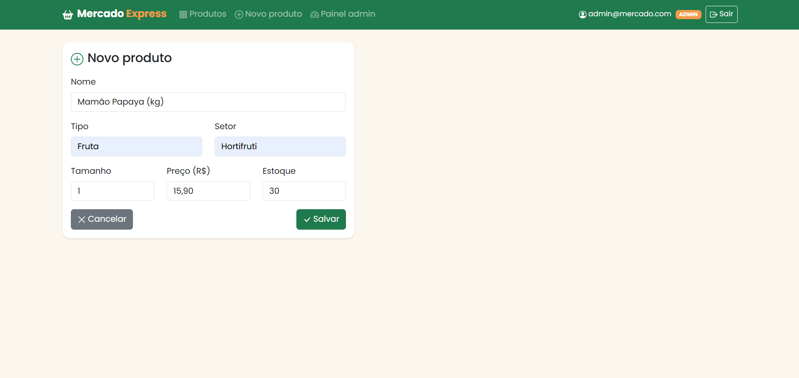

### Update: editar produto (ADMIN)


### Delete: excluir produto (ADMIN)

Botão **Excluir** com confirmação antes do `POST /mercado/{id}/excluir`.

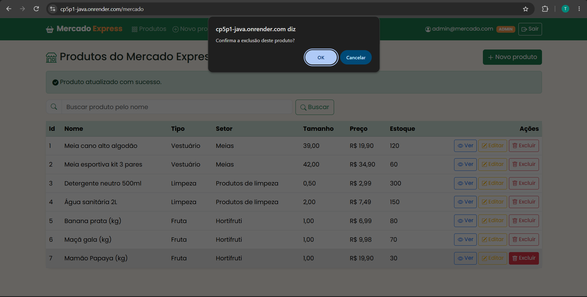

### Acesso negado (403)

Exibida quando um CLIENTE tenta acessar uma rota exclusiva de ADMIN (ex.: `/mercado/novo`).

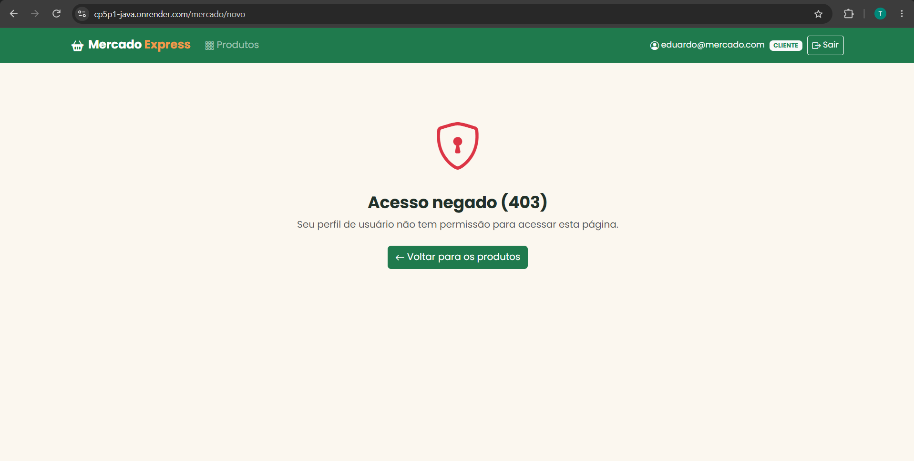

## Deploy (Render)

O projeto tem um `Dockerfile` (build multi-stage com Maven e execução com JRE 21) e um `render.yaml` (Blueprint), que cria **o banco PostgreSQL e o Web Service** de uma vez:

1. No [Render](https://render.com): **New → Blueprint** e selecione este repositório.
2. O Render lê o `render.yaml`, cria o banco `mercado-express-db` e o serviço `cp5p1-java`, e liga automaticamente as variáveis `DB_HOST`, `DB_PORT`, `DB_NAME`, `DB_USERNAME` e `DB_PASSWORD`.
3. Quando solicitado, informe o valor de `ADMIN_SENHA` (a senha do ADMIN de produção).
4. Depois do build, a aplicação fica disponível em `https://<nome-do-servico>.onrender.com`.

> No plano gratuito, o serviço "dorme" após um tempo sem acesso, e o primeiro acesso pode levar cerca de 1 minuto.

## Testes automatizados

`SegurancaFluxoTest` (11 testes, MockMvc + H2) cobre:

- landing page pública e tela de login personalizada
- usuário anônimo redirecionado ao login
- login do ADMIN indo para `/admin` e do CLIENTE indo para `/mercado`
- e-mail não cadastrado redirecionando para o Sign Up, com o e-mail preenchido
- senha errada voltando para `/login?error`
- cadastro criando CLIENTE com senha BCrypt, e validação de senhas diferentes
- CLIENTE recebendo 403 nas rotas de escrita e no painel
- CRUD completo pelo ADMIN e validação do formulário de produto
